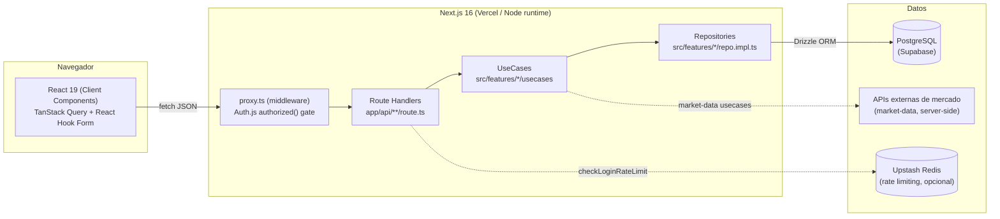
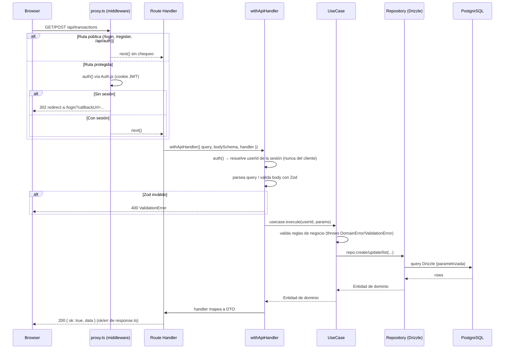

# Arquitectura — CifraTrack

> Documentación de arquitectura, infraestructura y ciclo de vida de un request.
> `CLAUDE.md` apunta acá para contexto extendido. Mantener sincronizado con el código
> en cada cambio que afecte capas, infraestructura o el pipeline de un request.
> Última verificación contra código: 2026-07-16.

---

## 1) Visión general

CifraTrack es una app de control financiero personal construida con **Next.js 16 (App Router)** +
**TypeScript strict**, siguiendo **Clean Architecture / DDD por capas** con organización
**Feature-Sliced**. No hay backend separado: los Route Handlers de Next.js son el backend.



---

## 2) Capas (no negociables)

```
UI (React + hooks)  →  API Route (app/api/**)  →  UseCase  →  Repository (Drizzle)  →  DB
                                                      ↑ retorna Entidades de Dominio
                    ←  mapea a DTO               ←  UseCase
```

| Capa | Responsabilidad | Puede importar de | NO puede importar de |
|---|---|---|---|
| UI (`src/features/*/ui`, `src/widgets`) | Renderizado, hooks de TanStack Query | hooks del feature, `src/shared/ui` | Drizzle, `repo.impl.ts`, `src/shared/db` |
| API Routes (`app/api/**/route.ts`) | Auth check, parseo request→DTO, invocar UseCase, responder JSON | `withApiHandler`, UseCases, mappers | Drizzle directo, lógica de negocio |
| UseCases (`src/features/*/usecases`) | Reglas de negocio, orquestación | interfaces de repo (`src/entities/*/repo.ts`) | Drizzle directo, Next.js (`NextRequest`/`NextResponse`) |
| Repositories (`src/features/*/repo.impl.ts`) | Queries Drizzle, mapeo row↔entidad | `src/shared/db`, entidades de dominio | UseCases, API routes |
| Domain Entities/VOs (`src/entities/*/model`) | Invariantes de negocio | nada de capas superiores | features, app, Next.js |

Ver `docs/reglas-de-negocio.md` para las reglas de negocio concretas que estas capas implementan.

---

## 3) Ciclo de vida de un request autenticado



`withApiHandler` (`src/shared/lib/api-handler.ts`) centraliza: chequeo de sesión (salvo `public: true`),
parseo de `query`/`body`, y el `try/catch` uniforme (`ZodError` → `ValidationError` 400,
`AppError` → su `statusCode`, resto → 500 vía `err()`).

---

## 4) Infraestructura y despliegue

- **Hosting**: Next.js 16 App Router — compatible con despliegue en Vercel (Node/Edge runtime híbrido); el middleware (`proxy.ts`) corre en cada request.
- **Base de datos**: PostgreSQL gestionado en Supabase. Acceso vía `postgres` (driver) + Drizzle ORM (`src/shared/db/client.ts`).
- **Migraciones**: Drizzle Kit (`drizzle.config.ts`) genera SQL desde `src/shared/db/schema.ts` hacia `src/shared/db/migrations/`. Nunca se edita el SQL generado a mano.
- **Rate limiting**: Upstash Redis (REST) vía `@upstash/ratelimit`, sliding window 5 req/min sobre login y register. **Fail-open**: si `UPSTASH_REDIS_REST_URL`/`TOKEN` no están configuradas, el rate limit queda deshabilitado (solo `console.warn`) — ver `src/shared/lib/rate-limit.ts`.
- **Autenticación**: Auth.js (NextAuth v5) con `Credentials` provider, sesión **JWT** (no hay tablas de sesión en DB: `accounts`/`sessions`/`verification_tokens` del schema son del adapter de NextAuth y están **sin uso** mientras no se agregue un provider OAuth).
- **Datos de mercado**: `GET /api/market-data/live` es la única ruta pública con lógica no trivial — arma catálogo y hace fetch a APIs externas desde el servidor, con caché de 5 min.
- **CI**: `.github/workflows/ci.yml` — `pnpm typecheck` + `pnpm lint` (+ `pnpm test`) en cada PR hacia `main`/`develop`.
- **Headers de seguridad** (`next.config.ts`): `X-Frame-Options: DENY`, `X-Content-Type-Options: nosniff`, `Referrer-Policy: strict-origin-when-cross-origin`, HSTS, `Permissions-Policy`. No hay `Content-Security-Policy` todavía (ver `docs/roadmap-mejoras.md` Fase 5).

---

## 5) Organización de carpetas (Feature-Sliced)

```
app/
  (app)/**            páginas protegidas (dashboard, transactions, investments, ...)
  (auth)/**            login, register
  api/**               route handlers (backend)
src/
  entities/<entity>/
    model/*.entity.ts     clase de dominio pura
    model/*.schema.ts      Zod (validación de input)
    repo.ts                 interfaz del repositorio (contrato)
  features/<feature>/
    usecases/*.usecase.ts  lógica de negocio
    repo.impl.ts             implementación Drizzle del contrato
    api/*.api.ts              fetcher cliente (fetch a /api/**)
    hooks/                     TanStack Query hooks
    mappers/*.mapper.ts       Dominio ↔ DTO
    model/query-keys.ts       query keys centralizadas
    ui/                         componentes del feature
  shared/
    config/env.ts              validación Zod de variables de entorno
    db/{client.ts,schema.ts,relations.ts,migrations/}
    lib/{auth.ts,money.ts,date.ts,errors.ts,response.ts,api-handler.ts,rate-limit.ts,password.ts}
    ui/                          kit shadcn/ui
  widgets/                      composiciones de UI de alto nivel (sidebar, dashboard, tablas)
```

Features existentes: `auth`, `categories`, `dashboard`, `investments`, `market-data`,
`payment-methods`, `profile`, `recurring`, `transactions`.

---

## 6) Documentos relacionados

- [`docs/reglas-de-negocio.md`](reglas-de-negocio.md) — reglas de negocio, contratos de API, convenciones de dominio.
- [`docs/base-de-datos.md`](base-de-datos.md) — DER completo, índices, checks, tablas sin uso.
- [`docs/diagramas-clases.md`](diagramas-clases.md) — UML de entidades, value objects, servicios y usecases.
- [`docs/diagramas-flujos.md`](diagramas-flujos.md) — diagramas de secuencia y de estados de los flujos principales.
