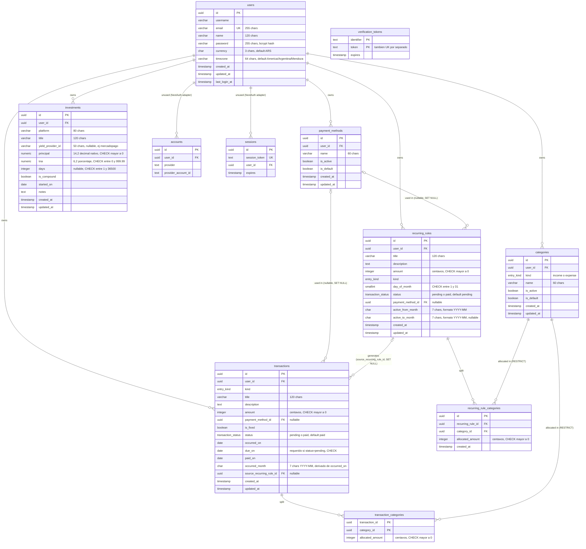

# Base de datos — CifraTrack

> DER, índices y checks del schema real (`src/shared/db/schema.ts`, PostgreSQL/Supabase).
> Fuente de verdad: el schema de Drizzle. `src/shared/db/migrations/schema.ts` y
> `migrations/relations.ts` son copias de introspección — **no** editarlas ni tomarlas como
> referencia. Actualizar este documento en cada `pnpm db:generate` que cambie tablas/relaciones.
> Última verificación contra código: 2026-07-16.

---

## 1) Diagrama entidad-relación



---

## 2) Notas por tabla

### `users`
- `email` único (`users_email_key`). `password` es hash bcrypt (nunca texto plano).
- `currency`/`timezone` con defaults (`ARS`, `America/Argentina/Mendoza`) — no hay multi-moneda ni multi-timezone activo hoy, son campos preparados.

### `categories` / `payment_methods`
- `(user_id, kind, name)` único en categorías; `(user_id, name)` único en formas de pago.
- `is_default`: seeds por usuario al registrarse (ver `docs/reglas-de-negocio.md` §3.5). No editables ni eliminables mientras `is_default = true`.
- `ON DELETE CASCADE` desde `users`.

### `recurring_rules`
- Versionado temporal: una regla "vigente" tiene `active_to_month = NULL`; se cierra seteando `active_to_month` y se crea una nueva fila desde el mes siguiente. Nunca se edita `active_from_month` de una regla con transacciones ya generadas.
- `idx_rr_user_month` (`user_id`, `active_from_month`) — soporta el filtro de reglas activas por rango de mes en la generación mensual.
- FK `payment_method_id` con `ON DELETE SET NULL`: borrar una forma de pago no rompe reglas existentes.

### `recurring_rule_categories` / `transaction_categories`
- Splits de categorías. `allocated_amount` en centavos, `CHECK > 0`.
- FK a `categories` con `ON DELETE RESTRICT`: **no se puede borrar una categoría** que esté referenciada en un split (ni de transacción ni de regla recurrente) — el repo debe manejar ese error o el UseCase validarlo antes.
- `transaction_categories` tiene PK compuesta `(transaction_id, category_id)` — no permite dos filas para la misma combinación.

### `transactions`
- `occurred_month` es una columna derivada de `occurred_on` (mantenida por la app, no generada por Postgres) — usada para filtros mensuales rápidos vía `idx_tx_user_month`.
- `CHECK chk_tx_pending_due_on`: si `status = 'pending'` entonces `due_on` es obligatorio. Si `status = 'paid'`, `due_on` es libre.
- `source_recurring_rule_id` (`ON DELETE SET NULL`) traza el origen cuando la transacción fue generada por una regla recurrente — permite la idempotencia de la generación mensual (`findExistingTransactionRuleIds`).
- Índices trigram (`gin_trgm_ops`) sobre `title`/`description` normalizados (minúsculas, sin acentos) para el filtro de búsqueda libre `q` — requieren que el filtro en `repo.impl.ts` aplique la misma normalización (`translate(lower(...))`) o el índice no se usa.
- `idx_tx_user_date` (`user_id`, `occurred_on`, `id`) sirve tanto el filtro por fecha como la keyset pagination (`ORDER BY occurred_on, id`).

### `investments`
- Único lugar del dominio donde el dinero **no** usa la convención `Money`/centavos: `principal` y `tna` son `numeric` (decimal nativo de Postgres). Ver `docs/reglas-de-negocio.md` §3.4.
- `days` nullable: inversión de duración indefinida (`isCompound` puede ir sin `days` fijo, según la entidad `Investment.validate()`).

### Tablas sin uso activo
- `accounts`, `sessions`, `verification_tokens`: parte del adapter de NextAuth para providers OAuth. El provider activo es `Credentials` con sesión **JWT** (no persiste en `sessions`). Se mantienen por si se agrega OAuth (Google) a futuro — ver `docs/roadmap-mejoras.md` Fase 10 antes de eliminarlas.
- `yield_rates`: comentada en `schema.ts`, tabla física puede seguir viva en la DB pero sin código que la use (ver comentario en `schema.ts` y Fase 10 del roadmap).

---

## 3) Enums

```ts
entry_kind         = "income" | "expense"
recurring_cadence   = "monthly"                 // único valor soportado hoy
transaction_status  = "pending" | "paid"
```

`recurring_cadence` está definido en el schema pero no hay columna que lo use actualmente
(las reglas recurrentes son siempre mensuales por diseño — `dayOfMonth` + versión por mes).
