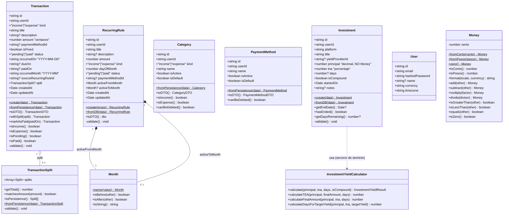
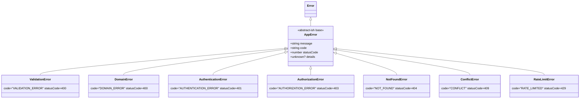

# Diagramas de clases (UML) — CifraTrack

> Diagramas de clases del dominio (entidades, value objects, servicios) y de la capa de
> aplicación (UseCases, contratos de repositorio). Actualizar en cada cambio de firma,
> invariante o clase nueva en `src/entities/**` o `src/features/**/usecases`.
> Última verificación contra código: 2026-07-16.

---

## 1) Capa de dominio (`src/entities/**`)

Notas:
- `Transaction`, `Investment` validan invariantes en el constructor salvo `skipValidation = true`
  (usado exclusivamente por `fromPersistence`/`fromDB` al reconstruir desde la base de datos).
- `Money` es el VO de dinero para transacciones/recurrentes (centavos). `Investment.principal`/`tna`
  son `number` decimal nativo — **no** pasan por `Money` (ver `docs/reglas-de-negocio.md` §3.4).
- `Category`/`PaymentMethod` no tienen `validate()` propio hoy — su única regla de negocio
  (`canBeDeleted`) delega en `isDefault`; la regla de "sin transacciones asociadas" vive en el
  UseCase (`hasTransactions` vía repo), no en la entidad.

---

## 2) Contratos de repositorio (`src/entities/*/repo.ts`)

```mermaid
classDiagram
    class ITransactionRepository {
        <<interface>>
        +list(params) PaginatedTransactions
        +findById(id, userId) TransactionWithNames?
        +create(userId, data) TransactionWithNames
        +update(id, userId, data) TransactionWithNames
        +delete(id, userId) void
        +getByMonth(userId, month) Transaction[]
        +getExpenseStatusSummary(userId, month) TransactionSummaryDTO
        +getMonthlySummary(userId, month) MonthlySummary
    }

    class IRecurringRuleRepository {
        <<interface>>
        +list(userId) RecurringRule[]
        +findById(id, userId) RecurringRule?
        +create(userId, data) RecurringRule
        +update(id, userId, data) RecurringRule
        +delete(id, userId) void
        +findCategories(ruleId) Split[]
        +findCategoriesByRuleIds(ruleIds) Record
        +setCategories(ruleId, categories) void
        +verifyPaymentMethodOwnership(userId, id) boolean
        +verifyCategoriesOwnership(userId, ids) boolean
        +findExistingTransactionRuleIds(userId, ruleIds, month) Set
        +bulkCreateTransactionsFromRules(items, month) void
    }

    class IInvestmentRepository {
        <<interface>>
        +list(userId, params) PaginatedInvestments
        +findById(id, userId) Investment?
        +create(investment) Investment
        +update(id, userId, data) Investment
        +delete(id, userId) void
        +count(userId) number
        +getTotalInvested(userId) number
    }

    class ICategoryRepository {
        <<interface>>
        +list(userId, filters?) Category[]
        +findById(id, userId) Category?
        +create(userId, data) Category
        +update(id, userId, data) Category
        +delete(id, userId) void
        +hasTransactions(id, userId) boolean
    }

    class IPaymentMethodRepository {
        <<interface>>
        +list(userId, filters?) PaymentMethod[]
        +findById(id, userId) PaymentMethod?
        +create(userId, data) PaymentMethod
        +update(id, userId, data) PaymentMethod
        +delete(id, userId) void
        +hasTransactions(id, userId) boolean
    }

    class IUserRepository {
        <<interface>>
        +findByEmail(email) User?
        +findById(id) User?
        +create(data) User
        +updatePassword(id, hash) void
    }

    class TransactionRepository {
        Drizzle impl
    }
    class RecurringRuleRepository {
        Drizzle impl
    }
    class InvestmentRepository {
        Drizzle impl
    }
    class CategoryRepository {
        Drizzle impl
    }
    class PaymentMethodRepository {
        Drizzle impl
    }
    class UserRepository {
        Drizzle impl
    }

    ITransactionRepository <|.. TransactionRepository
    IRecurringRuleRepository <|.. RecurringRuleRepository
    IInvestmentRepository <|.. InvestmentRepository
    ICategoryRepository <|.. CategoryRepository
    IPaymentMethodRepository <|.. PaymentMethodRepository
    IUserRepository <|.. UserRepository
```

---

## 3) UseCases por feature

```mermaid
classDiagram
    class ListUseCase~T~ {
        <<generic base>>
        -ListRepo repo
        +execute(userId, filters?) TResult
    }
    class GetByIdUseCase~T~ {
        <<generic base>>
        -FindByIdRepo repo
        -string resourceLabel
        +execute(id, userId) TEntity
        "throws NotFoundError si no existe"
    }
    class DeleteUseCase {
        <<generic base>>
        -DeleteRepo repo
        +execute(id, userId) void
    }

    class UpsertTransactionUseCase {
        -ITransactionRepository repository
        +create(userId, data) TransactionWithNames
        +update(id, userId, data) TransactionWithNames
        -validateSplits(amount, splits) void
    }
    class DeleteTransactionUseCase
    class ListTransactionsUseCase
    class GetTransactionByIdUseCase
    class GetTransactionsSummaryUseCase

    class UpsertRecurringRuleUseCase
    class DeleteRecurringRuleUseCase
    class ListRecurringRulesUseCase
    class GetRecurringRuleByIdUseCase
    class GenerateMonthlyRecurringTransactionsUseCase {
        -IRecurringRuleRepository repo
        +execute(userId, month) void
        "idempotente: filtra reglas ya generadas"
    }

    class UpsertCategoryUseCase {
        "bloquea edición si isDefault"
    }
    class DeleteCategoryUseCase {
        "bloquea si isDefault o hasTransactions"
    }
    class ListCategoriesUseCase
    class GetCategoryByIdUseCase

    class UpsertPaymentMethodUseCase {
        "bloquea edición si isDefault"
    }
    class DeletePaymentMethodUseCase {
        "bloquea si isDefault o hasTransactions"
    }
    class ListPaymentMethodsUseCase
    class GetPaymentMethodByIdUseCase

    class UpsertInvestmentUseCase
    class DeleteInvestmentUseCase
    class ListInvestmentsUseCase
    class GetInvestmentByIdUseCase

    class AuthenticateUserUseCase {
        -IUserRepository userRepository
        +execute(input) User
        "mitiga timing attack con hash dummy"
    }
    class RegisterUserUseCase {
        "inserta seeds de categorías/formas de pago"
    }
    class ChangePasswordUseCase
    class GetProfileUseCase
    class UpdateProfileUseCase

    class GetDashboardSummaryUseCase
    class GetLiveYieldsUseCase

    DeleteUseCase <|-- DeleteTransactionUseCase : podría extender (hoy clase propia por reglas futuras)
    GetByIdUseCase~T~ <|-- GetTransactionByIdUseCase
    ListUseCase~T~ <|-- ListTransactionsUseCase

    UpsertTransactionUseCase --> ITransactionRepository
    GenerateMonthlyRecurringTransactionsUseCase --> IRecurringRuleRepository
    AuthenticateUserUseCase --> IUserRepository
```

Nota: el diagrama de UseCases muestra la intención arquitectónica (`ListUseCase`/`GetByIdUseCase`/
`DeleteUseCase` genéricos para passthrough puro, ver `src/shared/lib/usecases/`). Antes de asumir que
un UseCase concreto extiende la base genérica, verificar el archivo — los que tienen reglas de
negocio propias (`Upsert*`, `Delete*` de categorías/formas de pago, `GenerateMonthly*`) están
escritos como clase independiente, sin herencia.

---

## 4) Jerarquía de errores (`src/shared/lib/errors.ts`)

