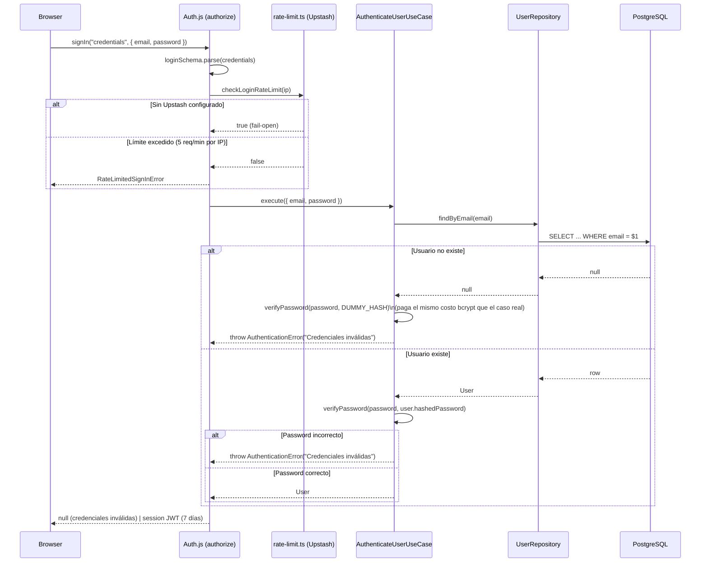
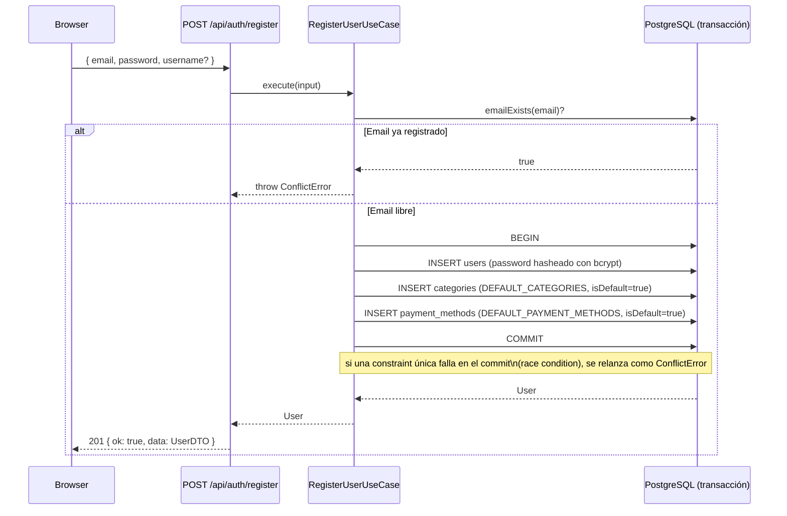
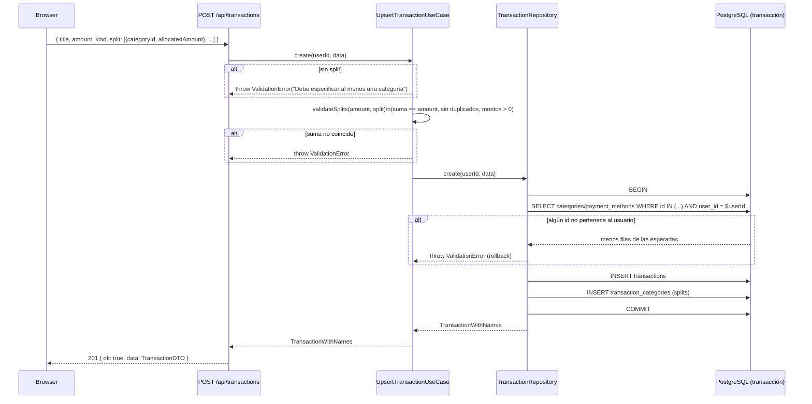
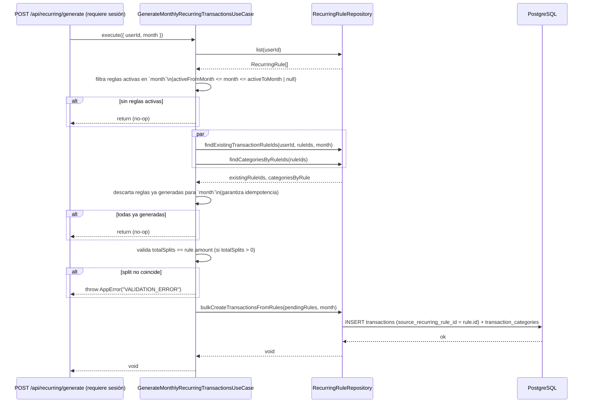
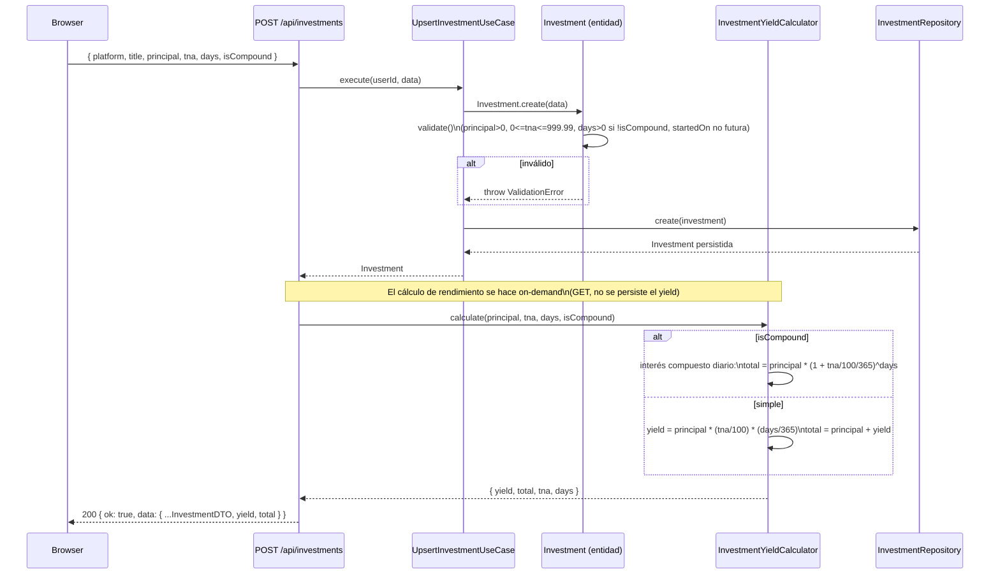
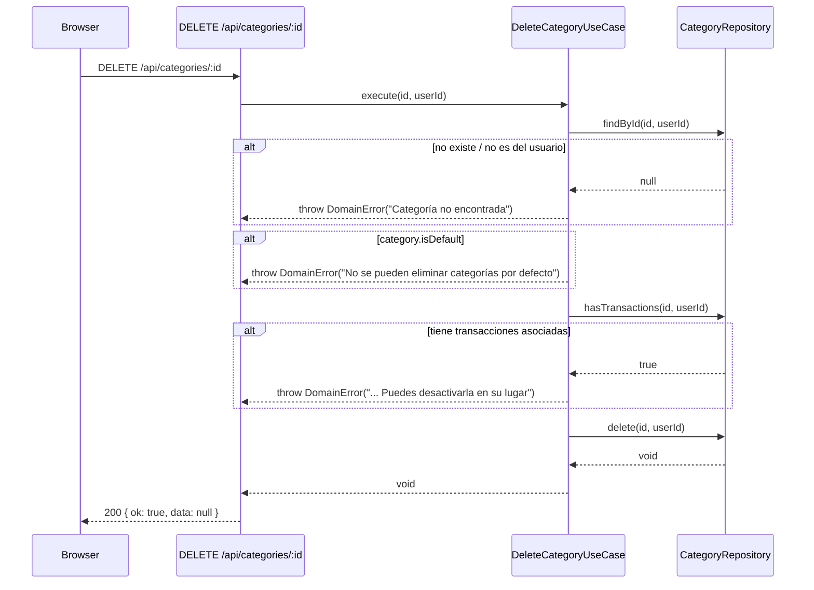
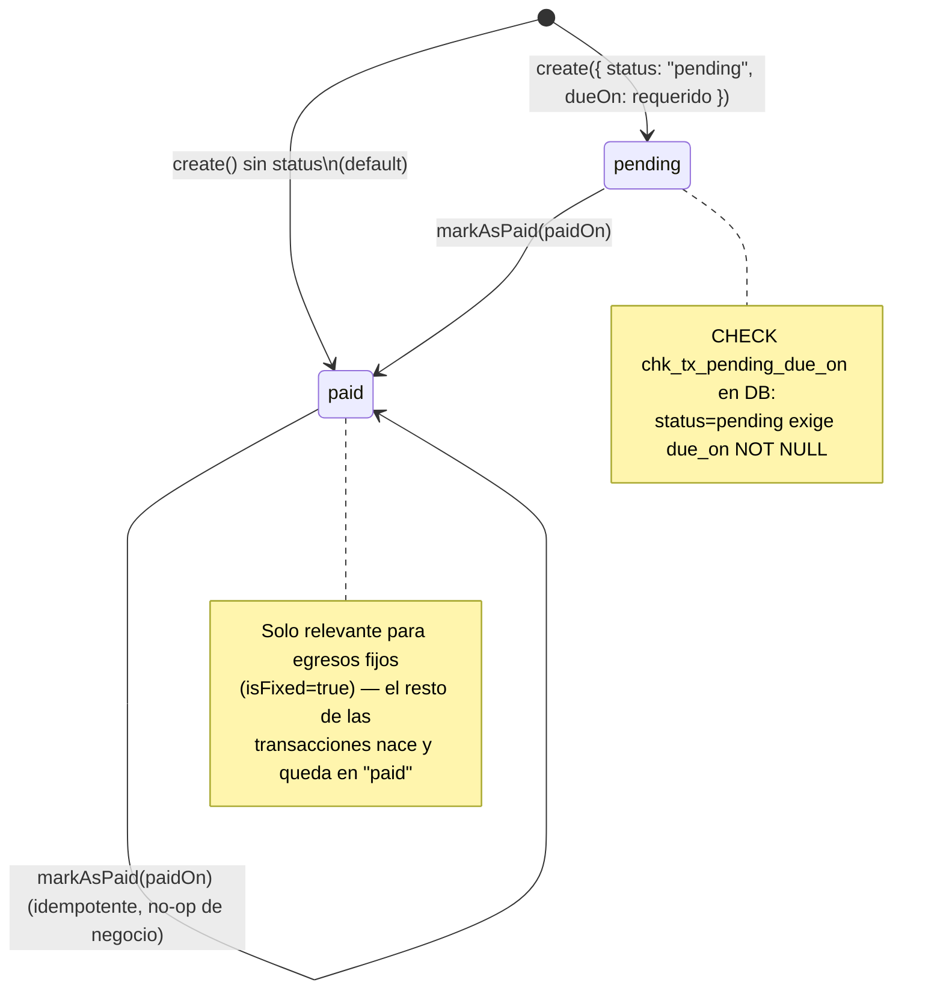
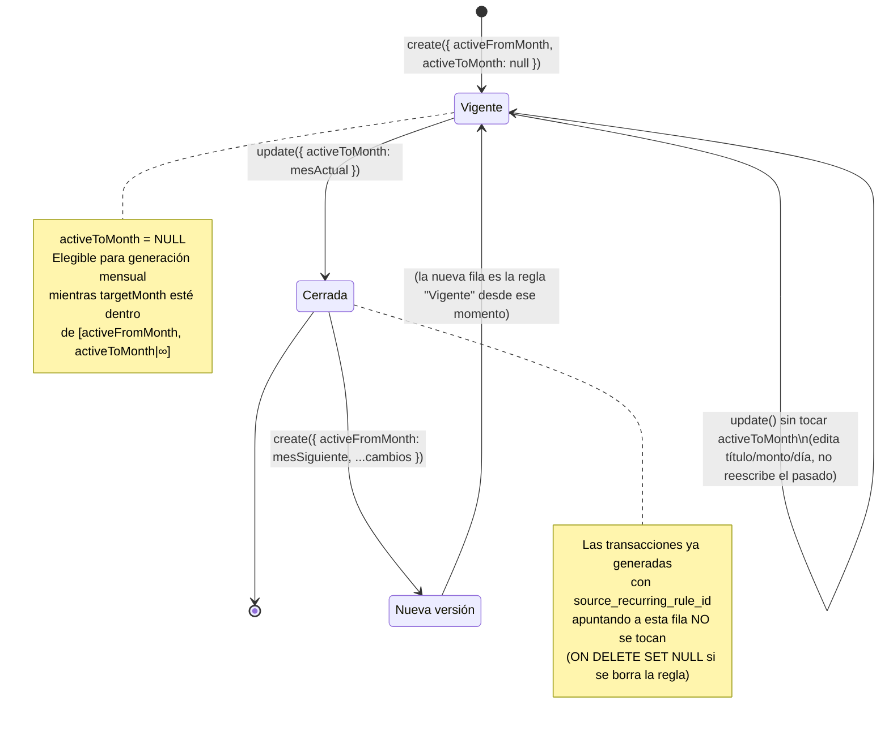

# Diagramas de secuencia y de estados — CifraTrack

> Flujos de negocio principales, en el estado actual del código (no del roadmap).
> Actualizar cuando cambie el flujo de un caso de uso descrito acá.
> Última verificación contra código: 2026-07-16.

---

## 1) Login (Credentials + rate limit + mitigación de timing)

La comparación bcrypt contra un hash dummy cuando el email no existe evita que un atacante
distinga "email inexistente" de "password incorrecto" por tiempo de respuesta — ver
`src/features/auth/usecases/authenticate-user.usecase.ts`.

---

## 2) Registro de usuario (con seeds)

---

## 3) Crear transacción con split multi-categoría

---

## 4) Generación mensual de transacciones recurrentes (idempotente)

**No es un cron público**: la ruta `POST /api/recurring/generate` requiere sesión (no está en
`PUBLIC_PATHS` de `proxy.ts`). Si se agrega un trigger automático (cron), documentarlo acá y en
`docs/arquitectura.md` antes de exponerlo.

---

## 5) Cálculo de rendimiento de inversión

---

## 6) Eliminar categoría (regla de negocio con dos guardas)

El mismo patrón (guarda `isDefault` + guarda `hasTransactions`) aplica a
`DeletePaymentMethodUseCase`.

---

## 7) Diagrama de estados — `Transaction.status`

No hay transición `paid → pending` en el dominio actual (no existe método `markAsPending()` en
`Transaction`); revertir un pago requiere editar la transacción con los datos correctos.

---

## 8) Diagrama de estados — versionado de `RecurringRule`

"Editar" una regla recurrente vigente que ya generó transacciones en el pasado, en la práctica,
significa: cerrar la fila actual (`activeToMonth = mes anterior al cambio`) y crear una fila nueva
desde el mes del cambio en adelante — nunca se reescribe `activeFromMonth`/datos de una regla ya
cerrada. Ver `docs/reglas-de-negocio.md` §3.3.
